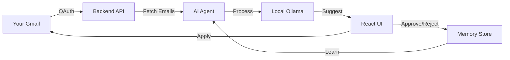

# 🚀 LLM Gmail Labeler

**LLM-powered Gmail labeling - No data leaves your machine!**

[](https://python.org)
[](https://react.dev)
[](https://ollama.ai)

> A privacy-first LLM-powered Gmail labeling assistant that uses your local Ollama model to intelligently categorize emails. Features a modern React UI, learns from your choices, and keeps all data on your machine.

---

## ✨ Features

- 🤖 **Local AI** - Uses Ollama (runs on your machine, no API costs)
- 🎯 **Smart Suggestions** - AI learns from your labeling decisions
- 💬 **Context-Aware** - Add notes to guide AI suggestions
- 📊 **Visual Interface** - Modern React UI with real-time updates
- 🔒 **Privacy First** - All data stays on your computer
- 🎨 **Auto-Emoji** - New labels get relevant emojis automatically
- ⚡ **Fast** - Caches emails and uses vector search

---

## 🎬 Quick Start (5 Minutes!)

### Step 1: Prerequisites

Before you start, make sure you have:

- **Python 3.10+** - [Download here](https://www.python.org/downloads/)
- **Node.js 16+** - [Download here](https://nodejs.org/)
- **Ollama** - [Install from ollama.ai](https://ollama.ai/)

### Step 2: Get Google OAuth Credentials

This app needs permission to read and label your Gmail. Here's how:

1. **Go to [Google Cloud Console](https://console.cloud.google.com/)**
   
2. **Create a new project** (or select existing)
   - Click "Select a project" → "New Project"
   - Name it "Gmail Labeler" → Create

3. **Enable Gmail API**
   - Go to "APIs & Services" → "Enable APIs and Services"
   - Search for "Gmail API" → Click "Enable"

4. **Create OAuth Credentials**
   - Go to "APIs & Services" → "Credentials"
   - Click "Create Credentials" → "OAuth client ID"
   - If prompted, configure OAuth consent screen:
     - User Type: External → Create
     - App name: "Gmail Labeler"
     - User support email: Your email
     - Developer contact: Your email
     - Save and Continue → Save and Continue → Back to Dashboard
   - Now create credentials:
     - Application type: **Desktop app**
     - Name: "Gmail Labeler Desktop"
     - Click "Create"

5. **Download the JSON file**
   - Click the download button (⬇️) next to your new OAuth client
   - Save it as `client_secret.json`

6. **Place the file**
   - Copy `client_secret.json` to `backend/credentials/` folder
   ```bash
   mkdir -p backend/credentials
   mv ~/Downloads/client_secret.json backend/credentials/
   ```

### Step 3: Install & Run

```bash
# Clone the repository (if you haven't already)
git clone <your-repo-url>
cd llm-gmail-labeler

# Install all dependencies (Python + React)
npm run install:all

# Start Ollama and pull the AI model
ollama serve  # In a separate terminal
ollama pull gemma3:4b  # Download AI model

# Start both backend and frontend
npm run start:dev
```

### Step 4: Authenticate & Use

1. **Open your browser** → http://localhost:3001

2. **First time setup:**
   - A Google OAuth browser window will open automatically
   - Select your Gmail account
   - Click "Continue" to grant permissions
   - Done! The window will close

3. **Start labeling:**
   - Fetch your unread emails
   - Click the ⭐ button on any email for AI suggestions
   - Approve (✓) or reject (✗) labels
   - The AI learns from your choices!

---

## 🎯 How It Works



1. **Fetch** - Securely connects to your Gmail
2. **Analyze** - AI reads email content and learns from past labelings
3. **Suggest** - Proposes labels based on content and your history
4. **Review** - You approve or reject suggestions
5. **Learn** - Approved labels are saved to improve future suggestions
6. **Apply** - Approved labels are automatically applied to Gmail

---

## 📂 Project Structure

```
llm-gmail-labeler/
├── backend/              # Python FastAPI backend
│   ├── api_server.py     # REST API endpoints
│   ├── agent.py          # AI classification logic
│   ├── gmail_client.py   # Gmail API wrapper
│   ├── memory_store.py   # Learning database
│   ├── credentials/      # Your OAuth credentials
│   └── data/             # Local database
│
├── frontend/             # React TypeScript frontend
│   ├── src/
│   │   ├── components/   # UI components
│   │   ├── hooks/        # Data fetching hooks
│   │   └── services/     # API clients
│   └── public/           # Static assets
│
└── package.json          # Workspace configuration
```

---

## 🎮 Usage Guide

### Main Interface

- **Fetch Emails** - Load unread emails (paginated)
- **⭐ Get Suggestion** - AI suggests a label for the email
- **✓ Approve** - Apply the suggested label
- **✗ Reject** - Reject and get a different suggestion
- **🔄 Regenerate** - Get alternative suggestion
- **💬 Add Context** - Guide AI with notes about the email

### Advanced Features

**Custom Context Messages:**
- Click the chat icon (💬) next to any suggestion
- Type a hint: "This is about work project X"
- AI will use your hint to suggest better labels

**Adjustable Threshold:**
- Higher = AI only suggests if very confident
- Lower = AI suggests more freely, creates new labels

**Pagination:**
- Set emails per page (default: 10)
- Navigate with previous/next buttons
- Floating navigation bar for easy access

---

## 🛠️ Configuration

### Change AI Model

```bash
# List available models
ollama list

# Pull a different model
ollama pull llama2

# Use it (edit frontend or pass as parameter)
```

### Change Ports

**Backend (default 8502):**
Edit `backend/api_server.py`:
```python
uvicorn.run(app, host="0.0.0.0", port=YOUR_PORT)
```

**Frontend (default 3001):**
```bash
PORT=YOUR_PORT npm run start:frontend
```

### Data Storage

- **OAuth Token**: `backend/credentials/token.json`
- **Email Memory**: `backend/data/memory.db` (SQLite)
- **Vector Index**: `backend/data/faiss.index`
- **Logs**: `backend/data/labeler.log`

---

## 🐛 Troubleshooting

### "Ollama model not found"
```bash
ollama pull gemma3:4b
ollama serve
```

### "OAuth failed" or "redirect_uri_mismatch"
- Make sure you selected "Desktop app" when creating OAuth credentials
- Delete `backend/credentials/token.json` and try again
- Check that `client_secret.json` is in `backend/credentials/`

### "Port already in use"
```bash
# Find and kill the process
lsof -ti:8502 | xargs kill -9  # Backend
lsof -ti:3001 | xargs kill -9  # Frontend

# Or use different ports
PORT=3002 npm run start:frontend
```

### "React build failed"
```bash
cd frontend
rm -rf node_modules package-lock.json
npm install
```

### "Database locked" errors
```bash
# Stop all servers, then clean
npm run clean
rm backend/data/memory.db
# Restart
npm run start:dev
```

---

## 📜 Development Scripts

```bash
npm run install:all      # Install all dependencies
npm run start:dev        # Start both servers
npm run start:backend    # Start only backend (port 8502)
npm run start:frontend   # Start only frontend (port 3001)
npm run build:frontend   # Build for production
npm run clean            # Clean all build artifacts
```

---

## 🏗️ Architecture

### Backend (Python FastAPI)

- **api_server.py** - REST API with CORS support
- **agent.py** - LangGraph workflow for email classification
- **gmail_client.py** - Gmail API integration with OAuth
- **memory_store.py** - SQLite database + FAISS vector search

### Frontend (React TypeScript)

- **Modern UI** - Tailwind CSS styling
- **Real-time updates** - Instant feedback
- **Smart caching** - Fast pagination
- **Type-safe** - Full TypeScript

### AI Pipeline

1. **Embedding** - sentence-transformers (all-MiniLM-L6-v2)
2. **Vector Search** - FAISS similarity matching
3. **LLM** - Ollama for intelligent suggestions
4. **Learning** - Stores approved labels for future reference

---

##  🔒 Privacy & Security

- ✅ All AI processing happens on your machine
- ✅ No data sent to external APIs (except Gmail)
- ✅ OAuth tokens stored locally
- ✅ Open source - inspect all code
- ✅ Self-hosted - you control everything

---

## 🎓 Tips for Best Results

1. **Start with a few labels** - Let AI learn your categories
2. **Use the context feature** - Guide AI with specific notes
3. **Approve good suggestions** - This teaches the AI
4. **Reject bad suggestions** - AI remembers what not to suggest
5. **Be consistent** - Use similar labels for similar emails
6. **Add emojis** - Makes labels easy to scan visually

---

## 🤝 Contributing

Contributions welcome! Areas for improvement:

- Better prompts for more accurate suggestions
- Support for more email providers
- Batch labeling operations
- Label management UI
- Export/import label rules
- Mobile responsive design

---

## 📝 License

MIT License - see LICENSE file for details

---

## 🙏 Credits

Built with:
- [Ollama](https://ollama.ai/) - Local AI
- [FastAPI](https://fastapi.tiangolo.com/) - Backend framework
- [React](https://react.dev/) - Frontend framework
- [LangGraph](https://github.com/langchain-ai/langgraph) - AI workflows
- [FAISS](https://github.com/facebookresearch/faiss) - Vector search
- [Gmail API](https://developers.google.com/gmail/api) - Email access

---

## 📧 Support

Having issues? Check:
1. [Troubleshooting section](#-troubleshooting) above
2. GitHub Issues for this project
3. Ollama documentation for model issues
4. Google Cloud Console for OAuth issues

---

**Made with ❤️ for privacy-conscious email users**
